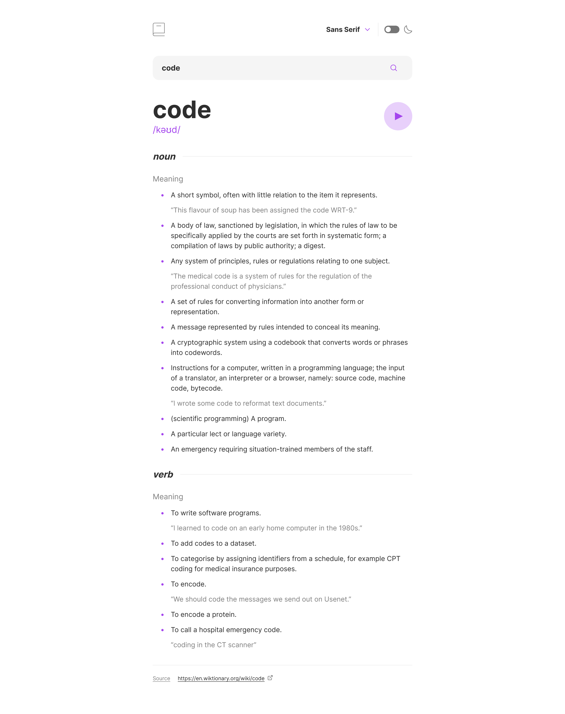

# Frontend Mentor - Dictionary Web App

This is my solution to the [Dictionary Web App challenge on Frontend Mentor](https://www.frontendmentor.io/challenges/dictionary-web-app-h5wwnyuKFL). Frontend Mentor challenges help you improve your coding skills by building realistic projects. The design is provided by Frontend Mentor, all code is written by me.

Live Site URL: https://dictionary-web-app-nine-dun.vercel.app

### Requirements

Users should be able to:

- Search for words using the input field
- See the Free Dictionary API's response for the searched word
- See a form validation message when trying to submit a blank form
- Play the audio file for a word when it's available
- Switch between serif, sans serif, and monospace fonts
- Switch between light and dark themes
- View the optimal layout for the interface depending on their device's screen size
- See hover and focus states for all interactive elements on the page
- **Bonus**: Have the correct color scheme chosen for them based on their computer preferences.

### Goals

My goals in taking on this challenge included the following:

- Use React to build this challenge.
- Write semantic and accessible HTML.
- Call a webservice and implement error handling with the useSWR hook
- Implement a dark mode via CSS custom properties
- Use clamp as an alternative for media queries
- Create custom components that match the provided design: a dropdown component to switch fonts, and a switch component to toggle the theme. Make them accessible, both for screen readers as well as for keyboard navigation.
- Use CSS modules.
- Use a custom hook to help in determining when to show a loading indication.
- Use environment variables in the context of a Vite project.
- Persist font and theme preferences in local storage.

### Screenshots of my implementation of the desktop layout

